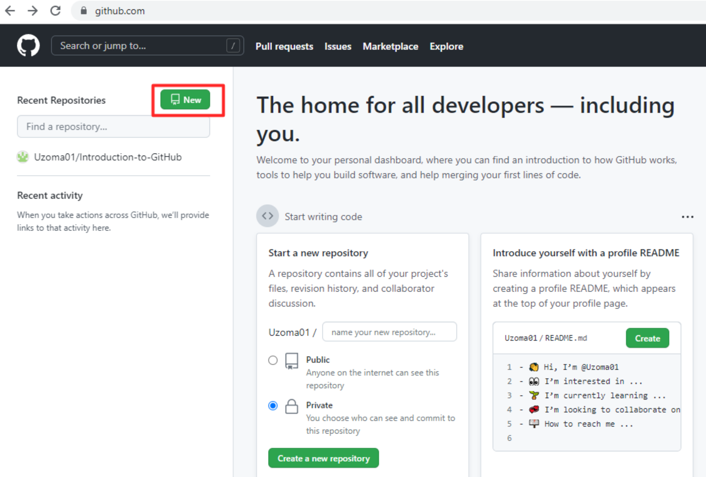
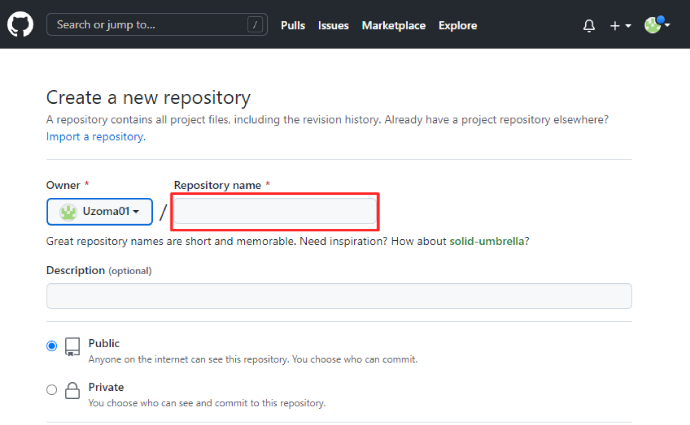
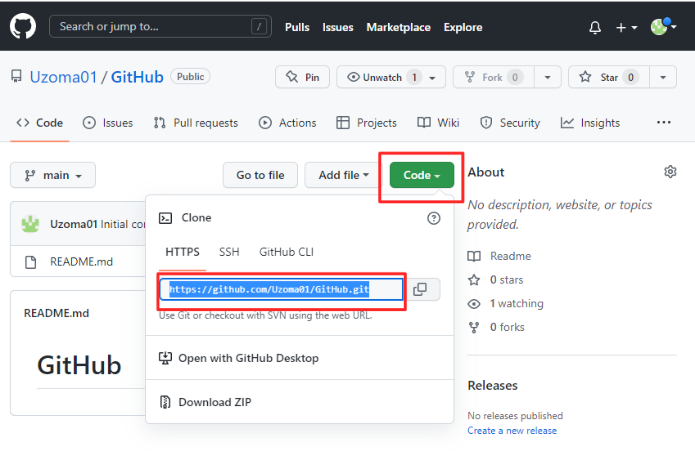
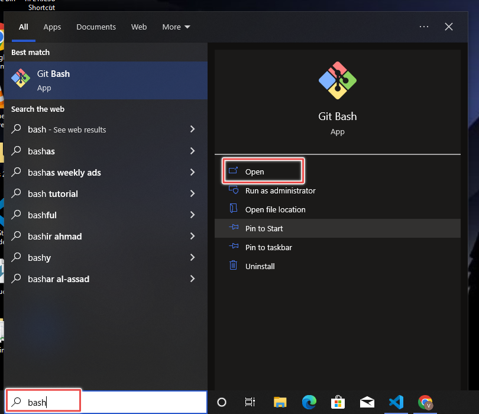
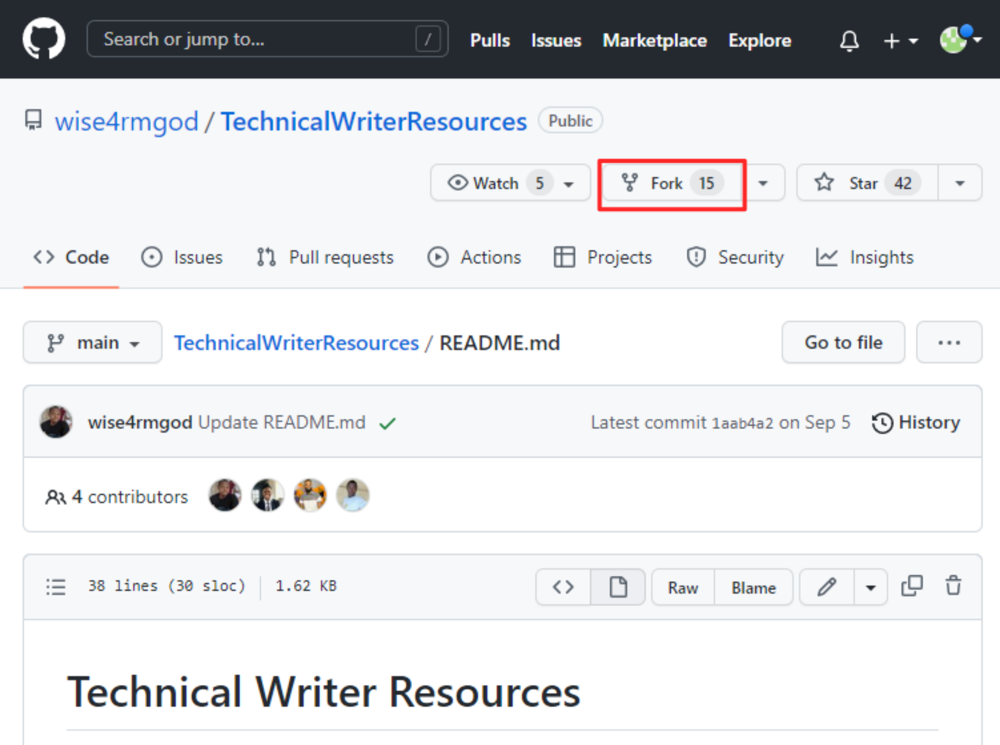
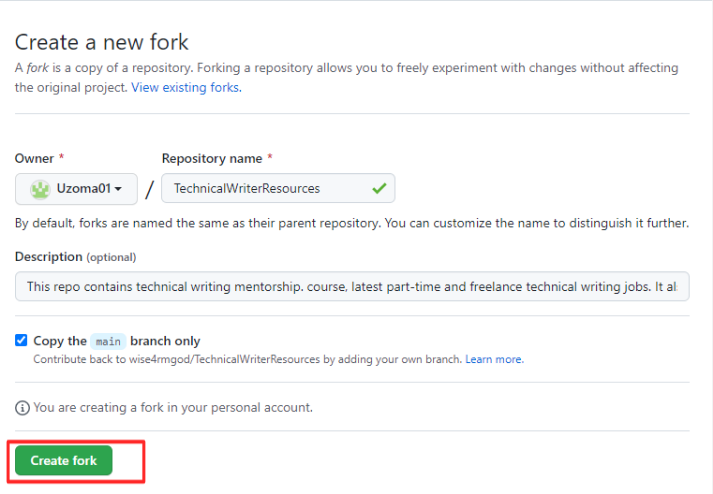
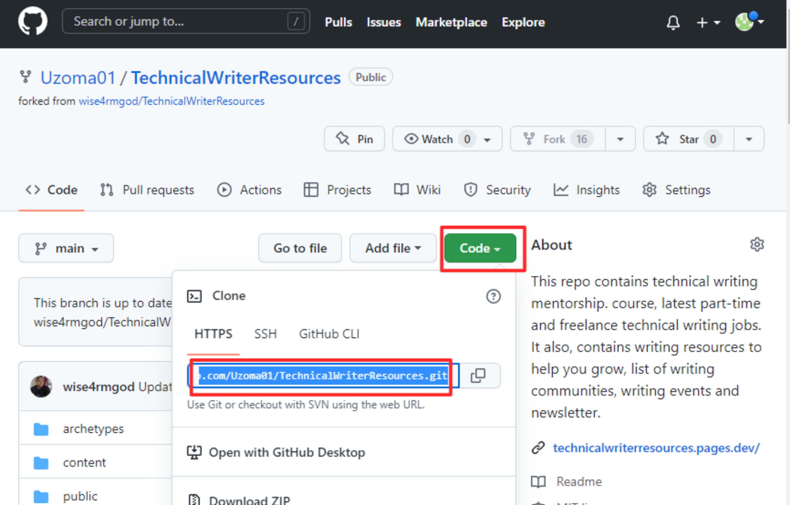
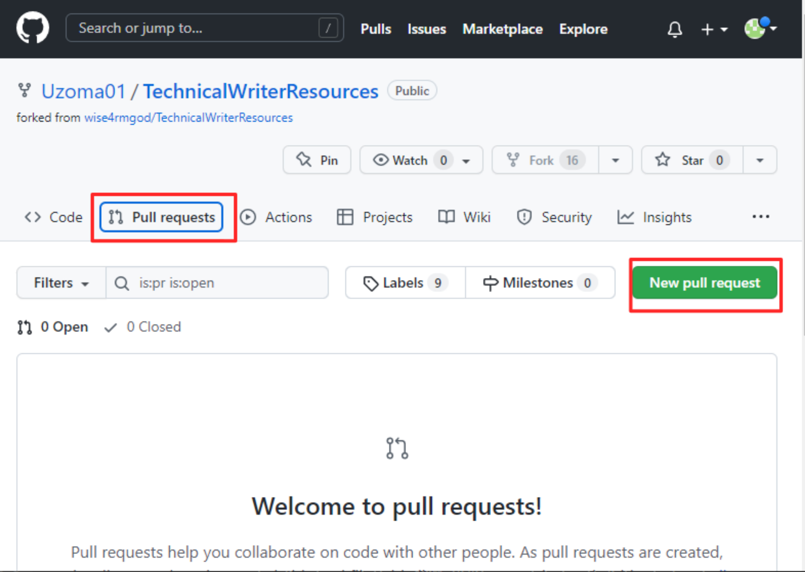
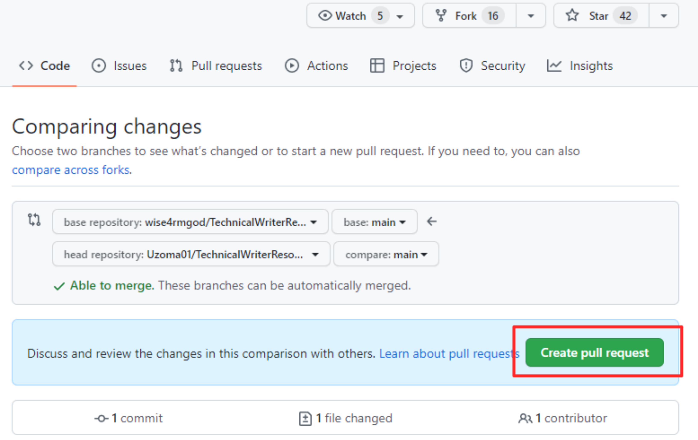
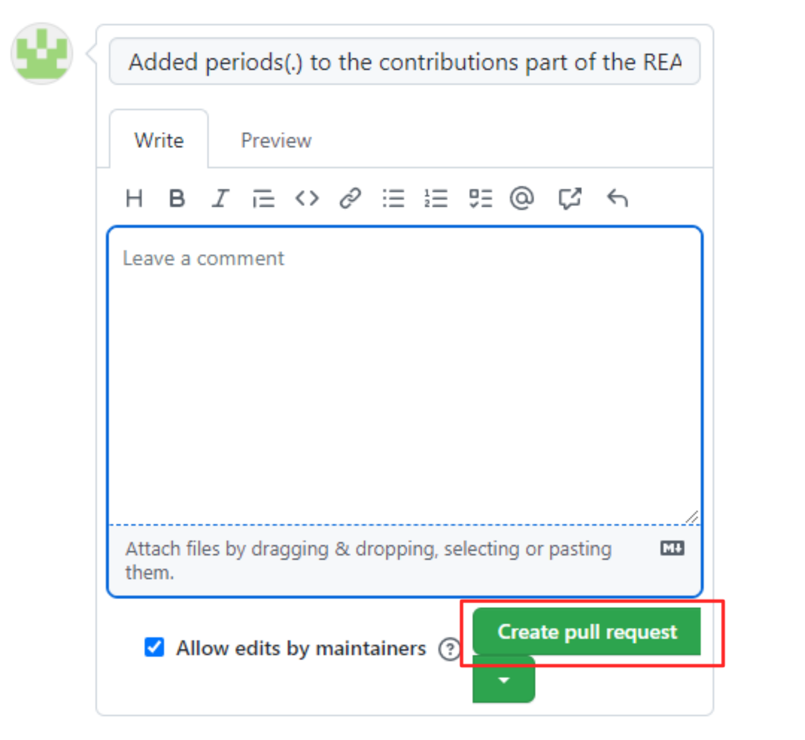

# Introduction to GitHub


## Table of content
1. Introduction.
2. What is GitHub?
3. Why Git?
4. Git vs. GitHub.
5. Clone (How to clone from GitHub).
6. Pull request (How to do a pull request).
7. Commits (How to do a commit).
8. GitHub Desktop vs. GitHub CLI.
9. Conclusion.

## Introduction

GitHub is a website used to store Git repositories. GitHub is a very important tool for developers, software engineers, and technical writers. It is extremely important to learn how Git and GitHub work. Git typically keeps files locally on your computer, but GitHub enables you to have a web-based folder for your files and version history. 

## What is GitHub?

GitHub is an online platform for storing, managing, and working together on software projects. With the help of this, you can work from anywhere in the world. It is used to communicate with version control software like Git.

## Why Git?

* Git is a distributed version control system. 
* Git performance is strong and reliable.
* Git is secured.
* Git is flexible.
* Git is widely accepted.

## Git vs GitHub

You now know what Git and GitHub are used for. Let's examine some of their main distinctions.

| Basis         | Git                 | GitHub                |
|--------       | -----------         |------------           |
| Introduction | Git was first introduced in April 2005.| GitHub was first introduced in October 2007. The site was later developed in April 2008. |
| Ownership | Git is maintained by Linux. | GitHub is maintained by Microsoft. |
| Application | Git is a command line tool. | GitHub has a graphical user interface (GUI). |
| Storage | Git is installed locally on your system for use and does not require the internet. | GitHub can be accessed on the web. It needs an internet connection. | 

For more information, see [Git vs GitHub.](https://www.interviewbit.com/blog/git-vs-github/?amp=1)


## Clone

On GitHub, the process of cloning involves downloading and copying the codes and files present from the repository.  In computing, a repository, or "repo", as defined by the Oxford dictionary, is a central location where data is stored. You should be familiar with some of the fundamental Git commands before we begin. To learn about the various Git commands, see [Introduction to basic command line.](https://github.com/ezeamaka2/basic-command-line) Please note that I'll be working with the Windows Operating System for the entire process.
Now, to clone a repo in GitHub, use the following order:
1. Head over to your GitHub profile.
2. Click the new icon.

3. Name your repo. You can use the name "GitHub".

4. Add a Readme.md file and create.

5. Click the code icon, and copy the URL.

6. Now, head over to your terminal. To locate your terminal on Windows, go to your search bar, type "bash" and click "Open."

Now, use the command ``` git clone [paste the URL here] ```.
7. Finally, navigate into the repo using the command ``` cd [folder name] ```. In our case, it is ``` cd github```. 

You have successfully cloned the repository.

## Commits

Commits are safe points. As you work, adding commits records your progress and changes as you work.
To do a commit, use the following order:
1. Stage the files you want to commit. Staging files gives Git permission to track your files. To stage a single file, use the command ``` git add [file name] ```. To stage multiple files, use the command ```git add . ``` or ``` git add --all ```.
2. Commit the file/files. To commit, use the command ``` git commit -m "This is for messages" ```. The ``` -m "Adds a descriptive message" ```. 

Your file or files have been successfully committed.

## Pull request
A pull request is a way to contribute to or collaborate on a project.  
To do a pull request in GitHub, use the following order:
1. Fork the repo you want to make changes to. A fork is a copy of a repo.

2. Create fork.

3. Click the code icon, copy the URL, and head over to your terminal to clone it.

4. In your terminal, use the command ``` git clone [paste URL here] ```. Click Enter.
Your output is similar to this: 

5. Navigate into the repository directory. Use the command ``` cd [Directory name] ```
6. Go to the project you wish to make changes to.
7. Save your changes, add them to the staging area, and commit. To add to the staging area, use the command ``` git add . ```. To commit, use the commmand ``` git command -m "" ```Leave a descriptive message about the changes between the quotation marks. Click Enter.
8. Push your changes back to the main branch. Use the command ``` git push origin main ```. Click Enter.
Your output is similar to this:

9. Return to your GitHub account to verify the changes in the forked repo.
10. Click pull requests > New pull request.

11. Click create pull request.

12. Finally, leave a comment and create pull request.



And your pull request was successfully created.

## GitHub Desktop vs. GitHub CLI

| S/N | GitHub Desktop | GitHub CLI |
| --- | -------------- | -----------|
| 1.  | It is easy to use. | It is more complicated for beginners. |
| 2.  | There's no need to write commands. It has a specific button for every git command. | There's need to write commands. |
| 3.  | It is efficient. | It is faster and more efficient. |
## Conclusion
Learning to use Git and GitHub can be overwhelming. It is, however, a very rewarding skill. This article's goal is to make GitHub and the Git concept more clear to you. Now, it is time to explore these things yourself. All the best!